# 🚗 Gestion Matériels

Application web de gestion du patrimoine d'une collectivité : le **parc de matériel** (véhicules, engins, outillage, mobilier, informatique), et tout ce qui s'y rattache au quotidien — **manifestations** et prêts, **demandes internes**, **bâtiments** et leurs contrôles obligatoires, **espaces verts**, **clés et badges**, **heures passées**, **cartographie** du mobilier urbain.


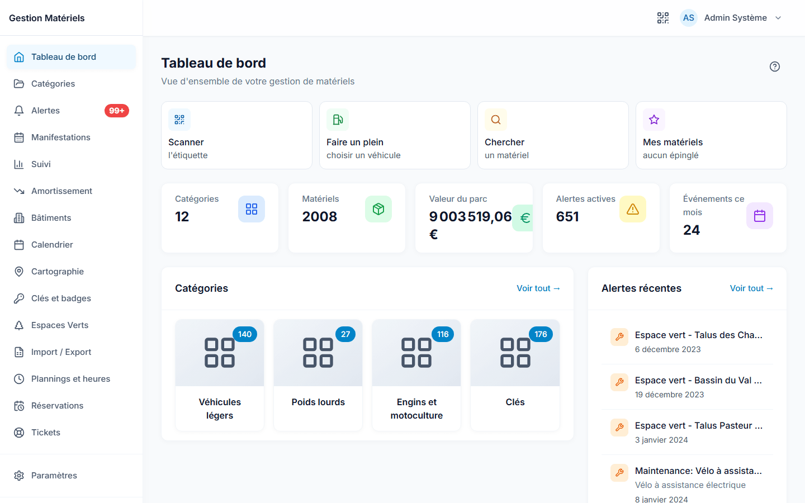

> Les captures de ce document sont prises sur une base remplie par le générateur de données de test : noms, adresses et chiffres sont fictifs. Voir [Captures d'écran](#-captures-décran).

## Sommaire

- [Points forts](#-points-forts)
- [Visite guidée](#-visite-guidée)
  - [Parc de matériel](#-parc-de-matériel) · [Sur le terrain](#-sur-le-terrain) · [Suivi des coûts](#-suivi-des-coûts)
  - [Manifestations](#-manifestations) · [Tickets](#-tickets--les-demandes-internes) · [Plannings et heures](#️-plannings-et-heures)
  - [Clés et badges](#-clés-et-badges) · [Bâtiments](#️-bâtiments) · [Organisation](#-organisation)
  - [Espaces verts](#-espaces-verts) · [Cartographie](#️-cartographie) · [Calendrier et alertes](#-calendrier-et-alertes)
  - [Réservations, amortissement, import/export](#-réservations-amortissement-importexport) · [Utilisateurs, rôles et droits](#-utilisateurs-rôles-et-droits) · [Administration](#️-administration) · [Interface](#-interface)
- [Installation](#-installation) · [Docker](#-déploiement-avec-docker) · [Configuration](#-configuration)
- [API](#-api) · [Sécurité](#-sécurité--authentification) · [État réel](#-état-réel) · [Développement](#️-développement)

Le détail de chaque module — ce qu'il fait, et pourquoi il le fait ainsi — est dans [docs/FONCTIONNALITES.md](docs/FONCTIONNALITES.md). La référence complète de l'API est dans [docs/API.md](docs/API.md).

## ✨ Points forts

- 🧩 **Un seul outil, un seul annuaire** : parc, prêts, demandes, bâtiments, clés et heures partagent les mêmes personnes, les mêmes bâtiments et les mêmes services
- 📲 **Fait pour le terrain** : téléphone, gants, pas de réseau — saisie hors ligne rejouée au retour du réseau, photo, GPS, scan de QR code
- 🔐 **Cloisonné** : cinq rôles, portée par catégorie appliquée à chaque route, gestion confiée bâtiment par bâtiment sans changer de rôle
- 📊 **Des chiffres qu'on peut projeter** : coûts du parc, des bâtiments, des manifestations et des espaces verts, comparés d'une période à l'autre, exportés en PDF et Excel
- 🔌 **Modulaire** : chaque module est un plugin activable, et de nouveaux plugins s'importent en ZIP
- 🌙 **Thème sombre**, 📲 **PWA installable**, ⚡ **temps réel** (Socket.io), 📖 **API documentée** (Swagger)
- 🐳 **SQLite ou MySQL**, image Docker prête, migrations appliquées au démarrage

## 🧭 Visite guidée

### 📦 Parc de matériel

Le parc est rangé en **catégories** et **sous-catégories**, chacune avec ses propres champs. Chaque matériel a sa fiche : compteurs, énergie, pleins ou recharges, entretiens, contrôles techniques, demandes, historique.

<table>
<tr>
<td width="50%">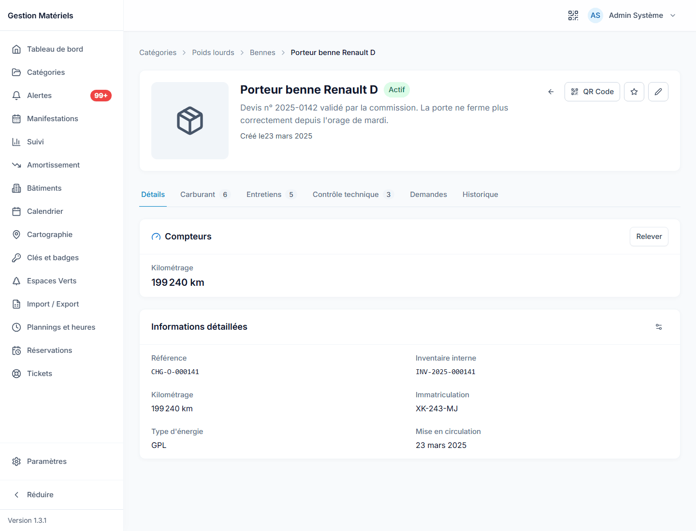</td>
<td width="50%">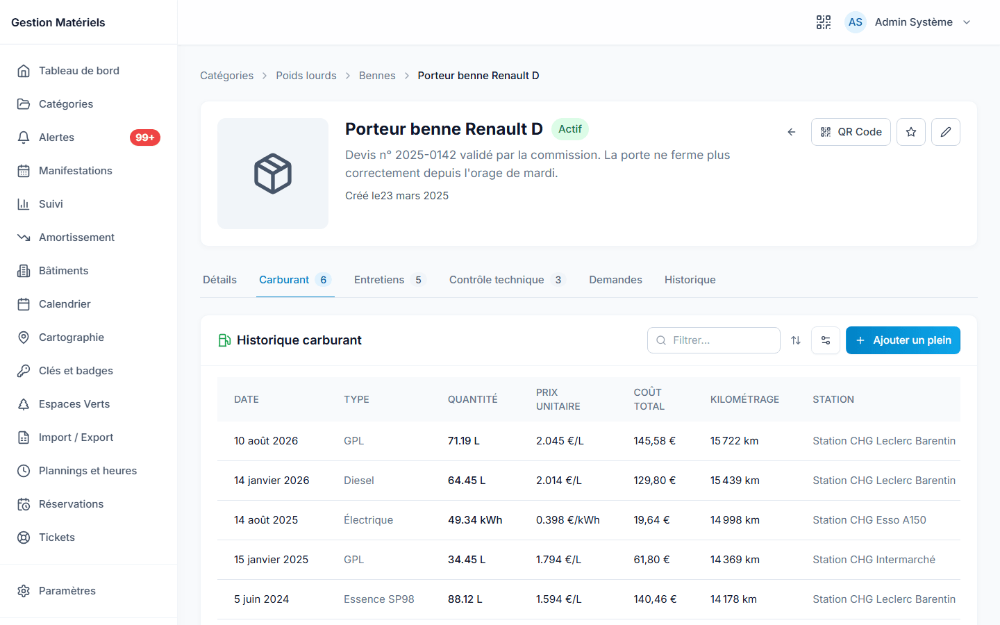</td>
</tr>
<tr>
<td>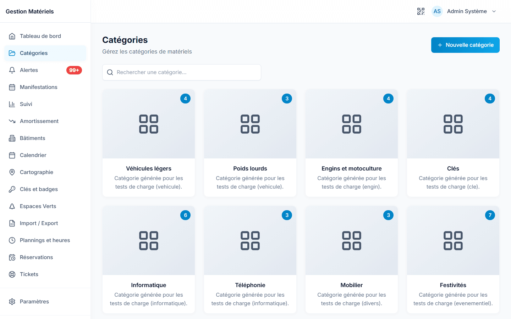</td>
<td>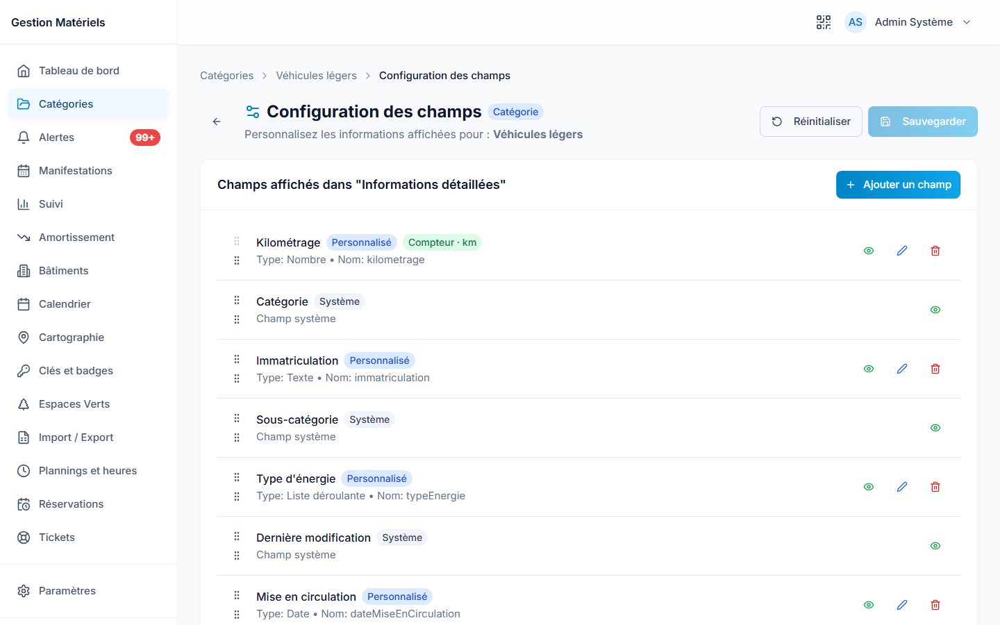</td>
</tr>
</table>

- 🎛️ **Champs personnalisés** par catégorie *et* par sous-catégorie (texte, nombre, date, liste…), avec héritage, ordre par glisser-déposer, masquage des champs système et prévisualisation
- 🔢 **Compteurs** : un champ Nombre peut devenir un compteur (km, heures moteur…). Il est proposé à chaque relevé, ne redescend jamais, et une catégorie sans compteur ne voit aucun champ de relevé
- ⛽ **Carburant ou électrique, un seul module** : le vocabulaire suit le type d'énergie du matériel — litres et stations pour un thermique, kWh et bornes pour un électrique, le choix à chaque saisie pour un hybride
- 🔧 **Entretiens** et 📋 **contrôles techniques** avec prestataires, centres, échéances et pièces jointes
- 📦 **Exemplaire unique ou lot** : un véhicule est unique, cinquante chaises forment un lot avec sa quantité
- 🔖 **Numéro d'inventaire interne**, à côté de la référence comptable, unique et cherchable
- 🧑‍🔧 **Attribution** à une personne (« Mon matériel »), depuis la fiche du matériel ou celle de la personne
- 📱 **QR codes** par matériel, et **planches d'étiquettes** imprimées en lot depuis une catégorie
- 🔎 **Recherche globale** sur tout le parc (nom, référence, numéro de série, inventaire, champs personnalisés), ⭐ matériels épinglés

### 📲 Sur le terrain

Les agents — jardiniers, mécaniciens, chauffeurs — travaillent sur téléphone, dehors, parfois sans réseau.

<table>
<tr>
<td width="33%">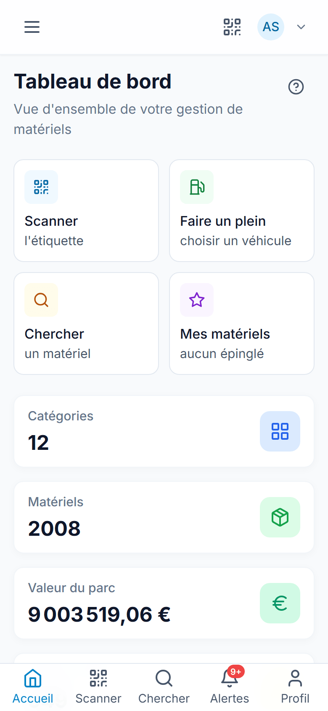</td>
<td width="33%">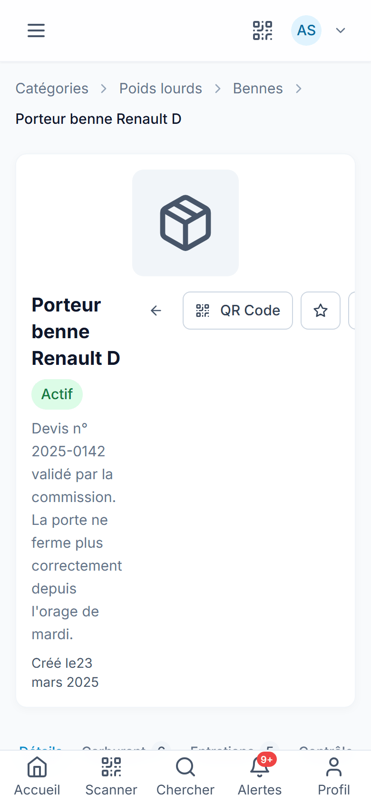</td>
<td width="33%">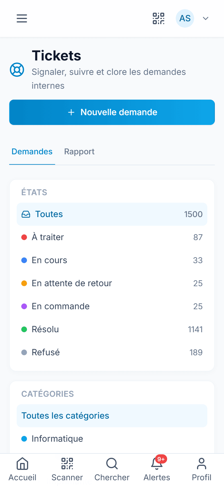</td>
</tr>
</table>

- 📴 **Hors réseau** : un plein, un entretien ou un contrôle saisi sans connexion est conservé et renvoyé au retour du réseau ; un bandeau compte les saisies en attente
- 📷 **Photo** prise depuis l'appareil, réduite avant l'envoi (12 Mo → ~400 Ko) et redressée côté serveur
- 📍 **Position GPS** en un bouton, avec sa précision et un aperçu de carte
- 🔳 **Scan de QR code** (`/scan`) qui ouvre directement la fiche du matériel
- ⚡ **Actions rapides** sur l'accueil : scanner, faire un plein, chercher, mes matériels ; **barre du bas** sur mobile
- 📋 **Listes fermées** pour les stations, prestataires et centres, pour que les rapports ne comptent pas trois fois la même station
- 🔠 **Confort de lecture** : taille du texte réglable, contraste renforcé pour le plein soleil, cibles tactiles d'au moins 44 px
- 💬 **Retours explicites** : messages de succès et d'échec, refus de droits nommés, reconnexion par-dessus le formulaire en cours quand la session expire

### 📊 Suivi des coûts

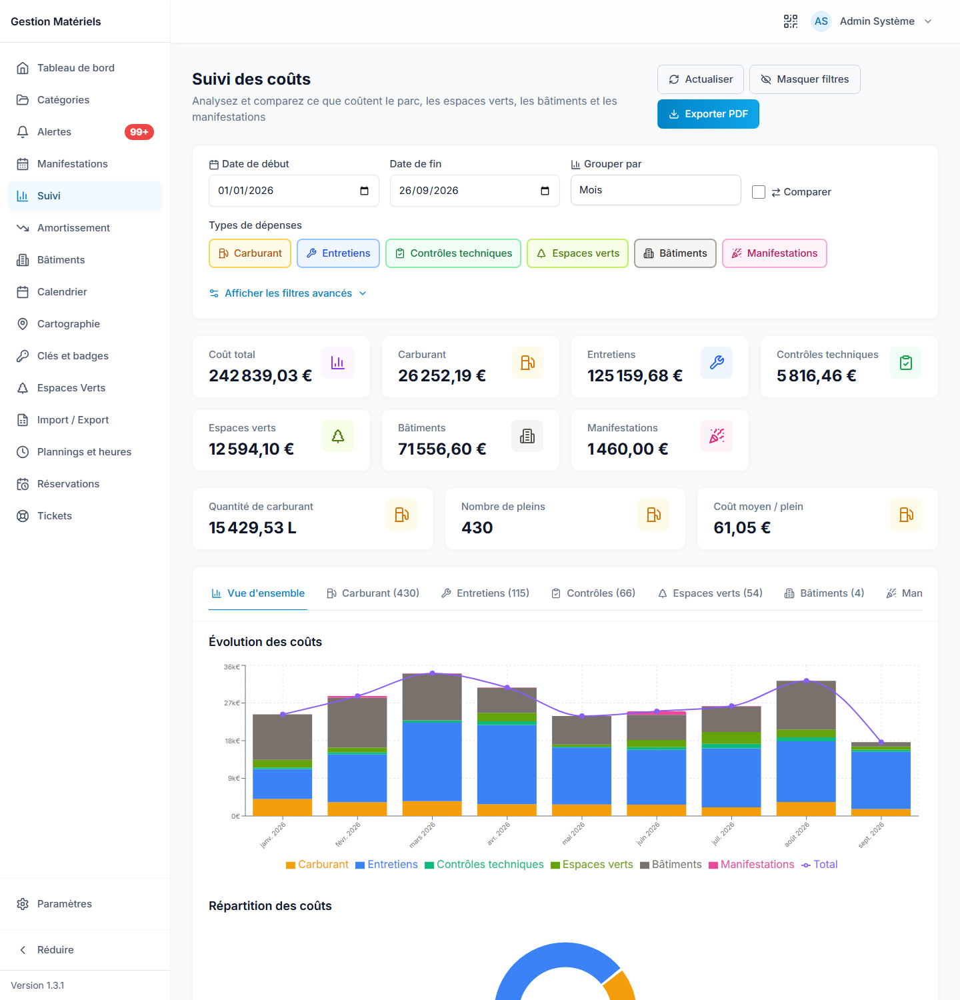

- Vue consolidée du **carburant**, des **entretiens**, des **contrôles techniques** et des **espaces verts**
- Filtres par période, catégorie, sous-catégorie, matériel et type de dépense ; regroupement par semaine, mois ou année
- **Comparaison** de deux périodes libres, de deux années ou de deux mois
- **Export PDF** du rapport, graphiques compris
- Accès réglé par rôle et par personne

### 🎪 Manifestations

Le prêt de matériel pour les événements de la commune, de la demande à l'archive.

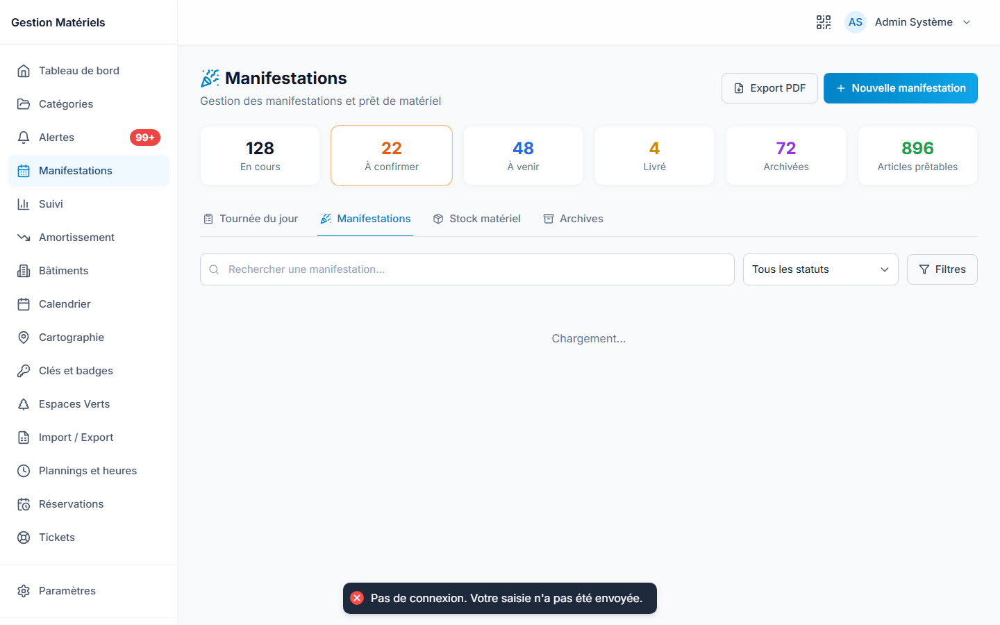

<table>
<tr>
<td width="50%">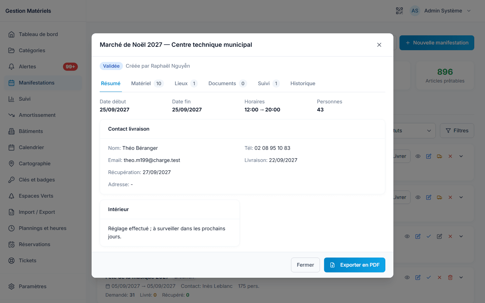</td>
<td width="50%">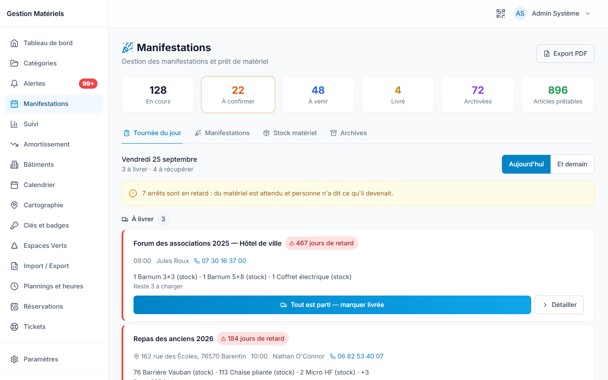</td>
</tr>
</table>

- 🔄 **Circuit en six étapes** : à confirmer → brouillon → validée → livrée → récupérée → archivée, avec un historique horodaté de chaque geste
- 📥 **Réception des demandes** d'une application de formulaires, par une adresse signée (HMAC-SHA256). La correspondance entre le JSON reçu et les champs se règle dans l'interface, et un **essai à blanc** dit ce qu'une demande donnerait sans rien créer
- 🏛️ **Services concernés et approbations** : chaque service approuve sa part, un **service coordinateur** prononce la validation, les responsables délèguent pendant leur absence, une direction peut suivre en copie
- 💬 **Conversation** entre services dans le fil de la manifestation, 📎 **pièces jointes** (arrêtés, plans, photos)
- 📈 **Stock prévisionnel et réel** : « aurai-je 200 chaises le 14 juillet ? » ; quantités demandées, livrées, récupérées et **perdues** ; conflits signalés sur le matériel unique (le camion ne se partage pas)
- 🚚 **Tournée du jour** : ce qu'il faut livrer et récupérer aujourd'hui ou demain, et ce qui est en retard
- 💶 **Coût réel** d'une manifestation : ce qu'on déploie, et ce qui ne revient pas
- 🔌 **Prestations** (raccordement électrique, débit de boissons, personnel) rangées par service, sans stock
- 📄 **Document pré-rempli par service** à partir d'un modèle Word, en `.docx` ou en PDF — converti par le serveur bureautique du **Nextcloud** de la commune
- 📊 **Export configurable** (colonnes, ordre, intitulés), déposé sur Nextcloud à chaque changement ; **export PDF** d'une manifestation
- 🔔 **Notifications réglables** à trois niveaux : collectivité, service, personne

<details>
<summary>Onglet Stock matériel</summary>

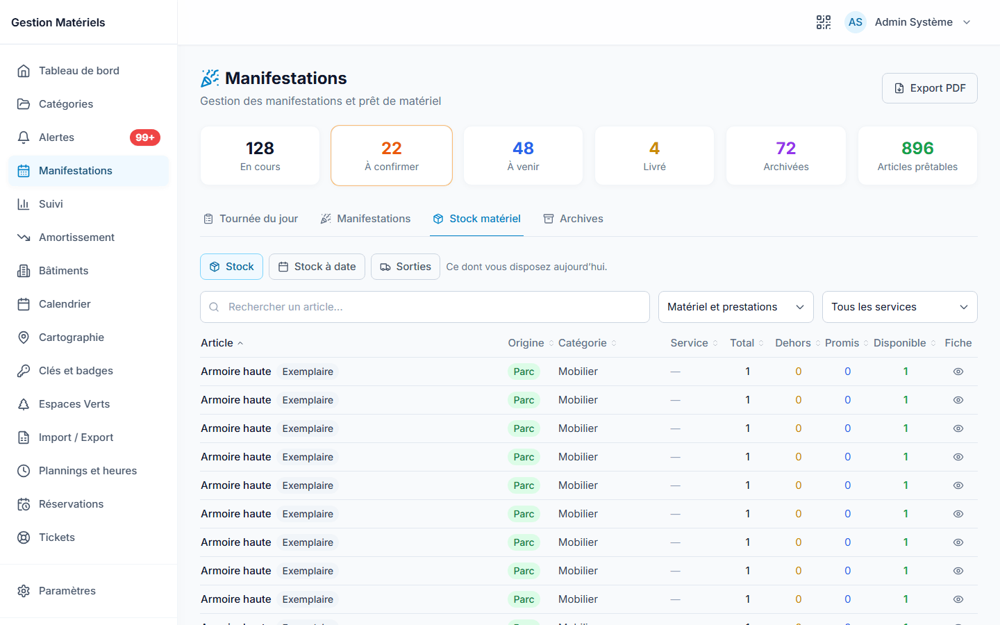

Le stock, le **stock à date** (engagements déduits) et les **sorties** (où est le matériel, chez qui, jusqu'à quand), sur tout le catalogue prêtable, triables sur chaque colonne et filtrables par service.
</details>

### 🎫 Tickets — les demandes internes

Signaler un problème, le suivre et le clore — sans deuxième outil, deuxième annuaire ni deuxième mot de passe.

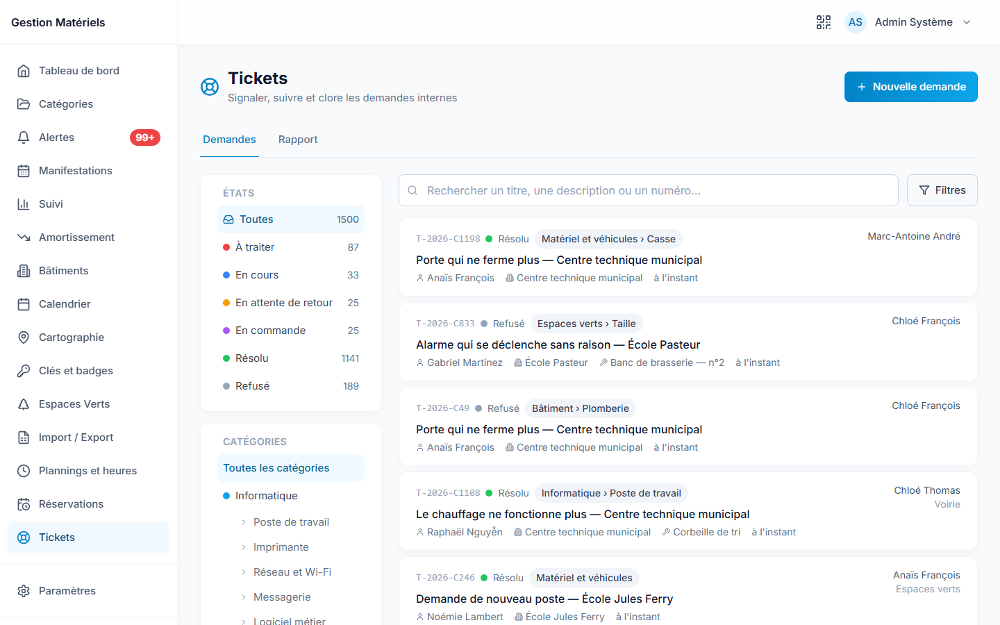

<table>
<tr>
<td width="50%">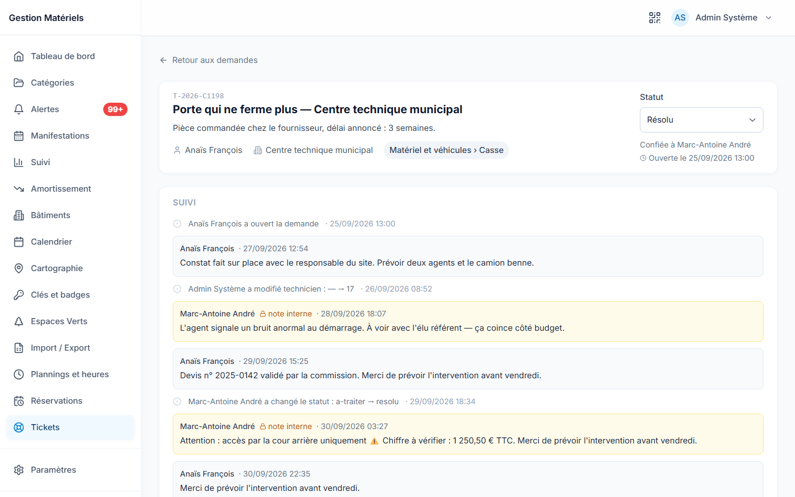</td>
<td width="50%">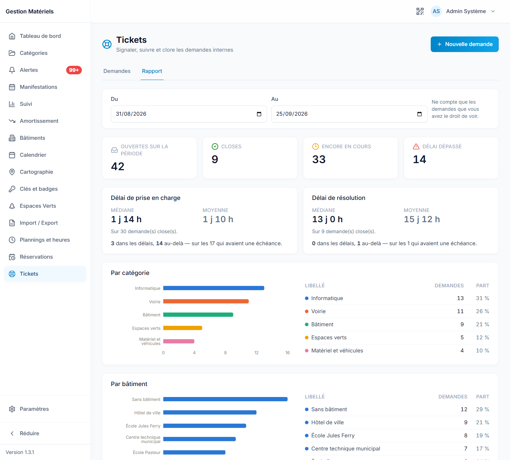</td>
</tr>
</table>

- 🎯 **Acheminement automatique** : la catégorie porte son service et son technicien, et l'écran dit au demandeur où part sa demande
- 🏢 **Le formulaire ne demande pas ce qu'il sait déjà** : bâtiment pré-rempli, matériel proposé parmi « mon matériel », bouton « Signaler un problème » depuis la fiche d'un matériel
- 🔐 **Rien n'est ouvert par défaut** : on demande dans les catégories qu'on vous donne ; un service ne voit pas les demandes d'un autre ; les collègues d'un bâtiment voient qu'une demande existe (pour ne pas la refaire) sans en lire le fil
- 💬 **Fil unique** : messages, changements d'état et pièces ; photos en vignette ; **notes internes** jamais envoyées au demandeur
- 🚦 **États personnalisables**, **délais** de prise en charge et de résolution par catégorie, retards signalés
- 📧 **Règles de courriel écrites en phrases** (« quand…, pour…, sur… → prévenir… »), qui s'ajoutent sans se remplacer, avec un bouton **Tester**
- ⏱️ **Temps passé** repris des plannings, et historique visible sur la fiche du matériel
- 📈 **Rapport** : volumes, médiane *et* moyenne des délais, répartitions par catégorie, bâtiment et technicien, chaque graphique avec son tableau
- 📥 **Reprise de GestSup** rejouable, avec essai à blanc par défaut

### ⏱️ Plannings et heures

Ce que le parc coûte en heures.

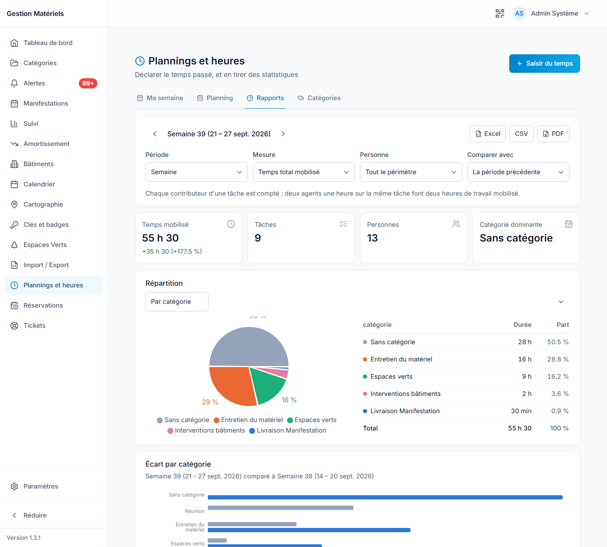

- 📝 **Saisie rapide sur téléphone** : date du jour, raccourci « Hier », durées toutes faites, durée affichée avant d'enregistrer ; catégorie créée à la volée
- 👥 **Le travail à plusieurs, compté juste** : deux agents une heure font deux heures mobilisées, mais une heure chacun — et le rapport dit laquelle des deux mesures il affiche
- 🗓️ **Vue planning** semaine ou jour, colorée par catégorie
- 📊 **Rapports** par semaine, mois, année ou période libre ; par catégorie, personne ou manifestation ; comparés à la période précédente ou à l'an passé
- 📤 **Exports** Excel, CSV et deux PDF (planning en paysage, rapport d'activité en portrait)
- 👔 **Encadrants** : un agent peut être suivi par plusieurs responsables ; chacun voit ses agents et rien de plus

### 🔑 Clés et badges

Trousseaux, clés et badges : ce qu'ils ouvrent, et chez qui ils sont.

<table>
<tr>
<td width="50%">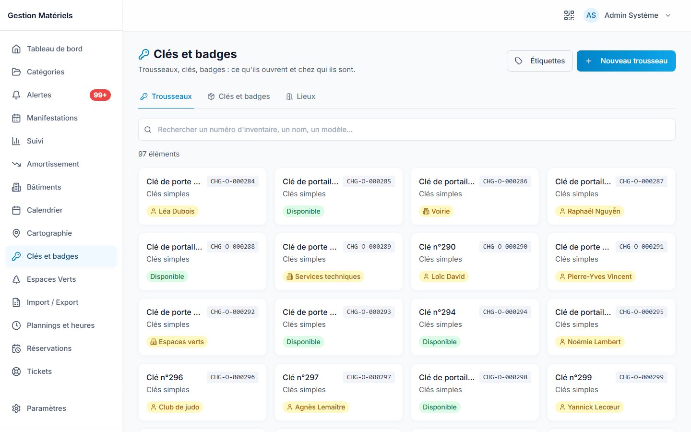</td>
<td width="50%">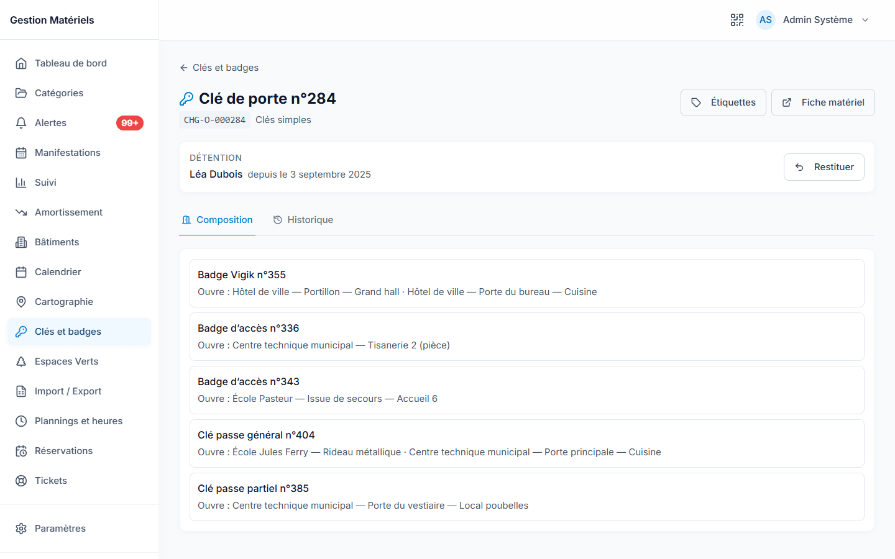</td>
</tr>
</table>

- 🗝️ **Clés et badges sont du matériel du parc** : même fiche, même historique, même coût. Le trousseau naît avec sa composition et son numéro d'inventaire (préfixe proposé, numérotation existante conservée)
- 🚪 **Ce que chaque clé ouvre** : bâtiment, porte, pièce — repris du référentiel des bâtiments
- 🤝 **Remise à quatre sortes de détenteurs** : une personne de l'annuaire, un service, un lieu (l'armoire à clés) ou un externe (entreprise, élu)
- 📜 **Historique** des remises et restitutions : « qui l'avait en mars ? »
- 🏷️ **Étiquettes sur planches Avery**, calées sur les cotes de la référence choisie. Le QR code mène à une **page publique** : celui qui ramasse un trousseau lit la consigne de restitution et rien d'autre ; un agent habilité y voit en plus le détenteur et la composition
- 💶 **Lots** avec prix, date d'achat et fournisseur, pour savoir ce que coûtent les clés
- 📥 **Reprise d'un inventaire Snipe-IT** en trois temps — connexion, aperçu ligne à ligne avec le lieu déduit du libellé, écriture du plan validé

### 🏛️ Bâtiments

Les contrôles qu'une collectivité doit faire, les rapports qui les prouvent, et ce que coûtent ses bâtiments.

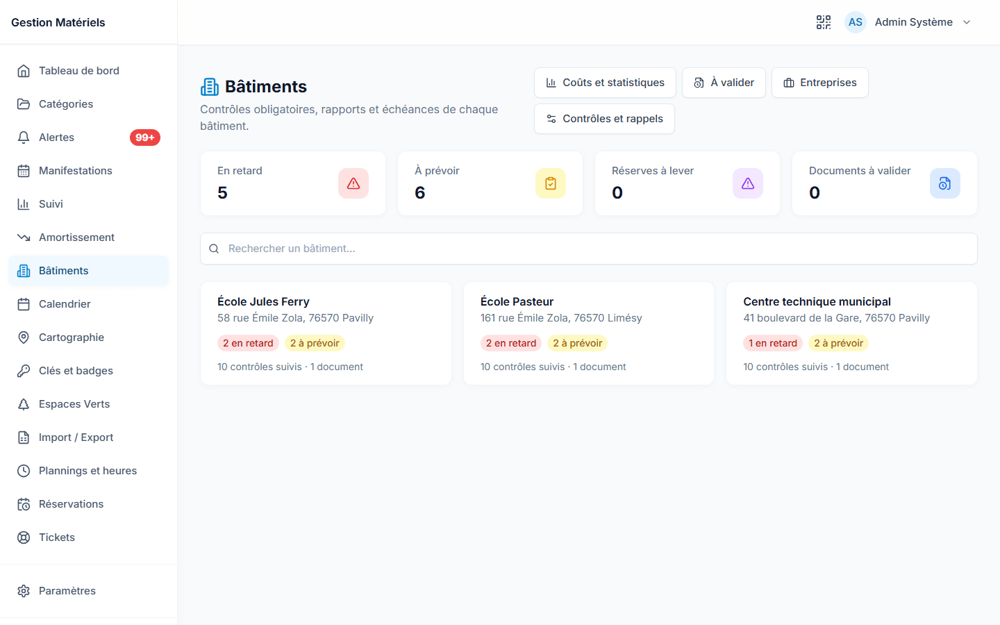

<table>
<tr>
<td width="50%">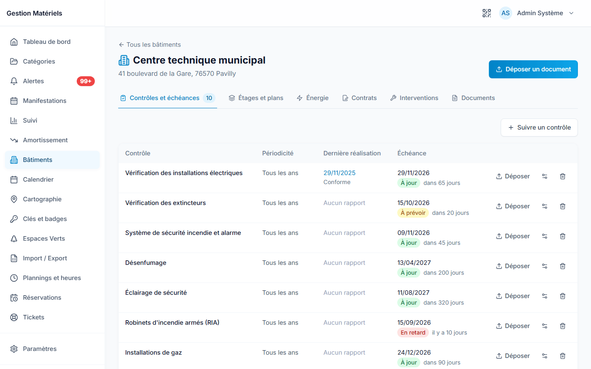</td>
<td width="50%">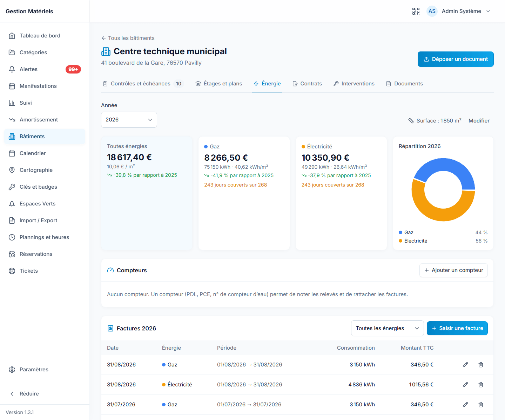</td>
</tr>
</table>

- 📋 **Catalogue livré** de 27 contrôles et objets (électricité, extincteurs, SSI, désenfumage, ascenseur, amiante, légionellose, aires de jeux, PPMS, DPE…), avec la référence réglementaire quand elle est sûre
- ⏰ **Périodicité et rappel** réglés une fois, appliqués à tous les bâtiments, surchargeables bâtiment par bâtiment ; l'**échéance** se lit sur le dernier rapport validé
- ✅ **Dépôt et validation** : le gestionnaire du bâtiment valide, le responsable (la directrice d'école) dépose et le document attend dans la file *À valider*
- 🔔 **Alertes** avant l'échéance, critiques une fois passée, envoyées aux gestionnaires du bâtiment
- 🗺️ **Étages et plans** : pièces dessinées sur le plan, surfaces calculées ; un clic sur une pièce montre son matériel, les clés qui l'ouvrent et leurs détenteurs
- ⚡ **Énergie** : compteurs, relevés et factures (électricité, gaz, eau, fioul, chaleur), comparés à l'année précédente, ratios au m²
- 📑 **Contrats de maintenance** avec leur date clé (veille du préavis d'un contrat tacite), rappelée un mois avant ; 🔧 **interventions** par pièce, entreprise et contrat
- 🏢 **Portail des entreprises extérieures**, sans compte : un lien et un code, des droits en lecture ou en dépôt par bâtiment et par objet, des dépôts qui attendent la validation
- 🔒 **Fichiers privés**, jamais servis en statique ni mis en cache

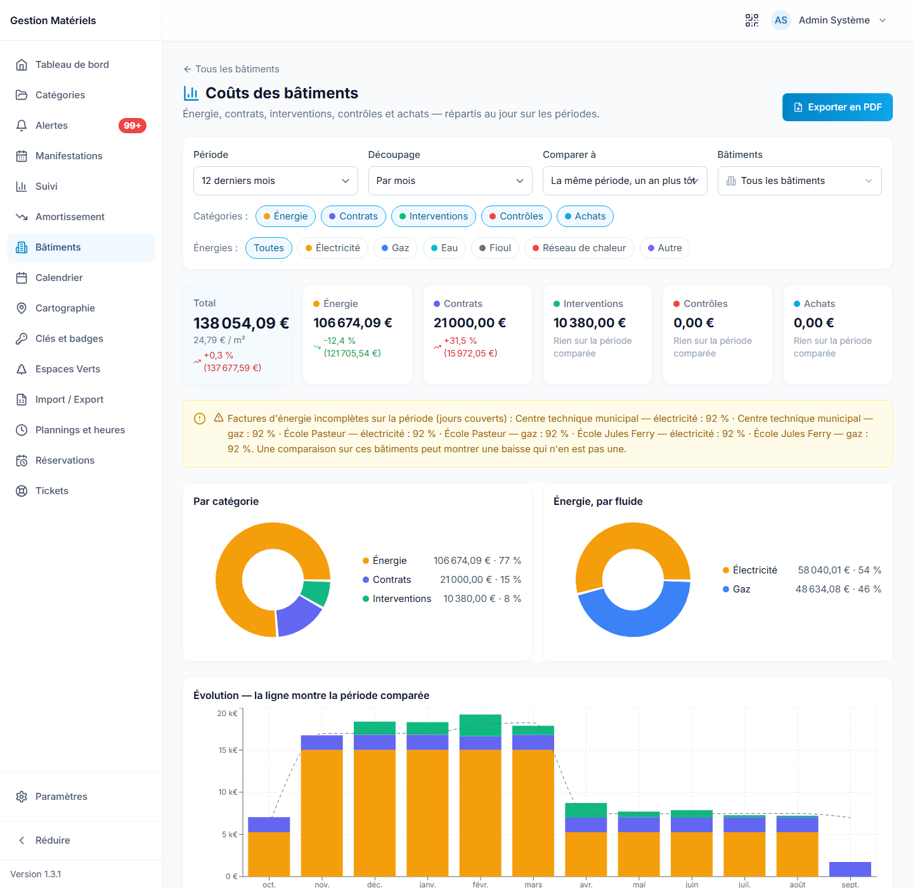

**Coûts et statistiques** : énergie, contrats, interventions, contrôles et achats, répartis au jour, par semaine, mois ou année et par bâtiment (au m² si l'on veut), comparés à la période précédente ou à l'an passé, avec un **export PDF** qui reprend les filtres.

### 🏢 Organisation

Bâtiments, salles et services servent à tous les modules ; ils se tiennent au même endroit, **Paramètres › Organisation**.

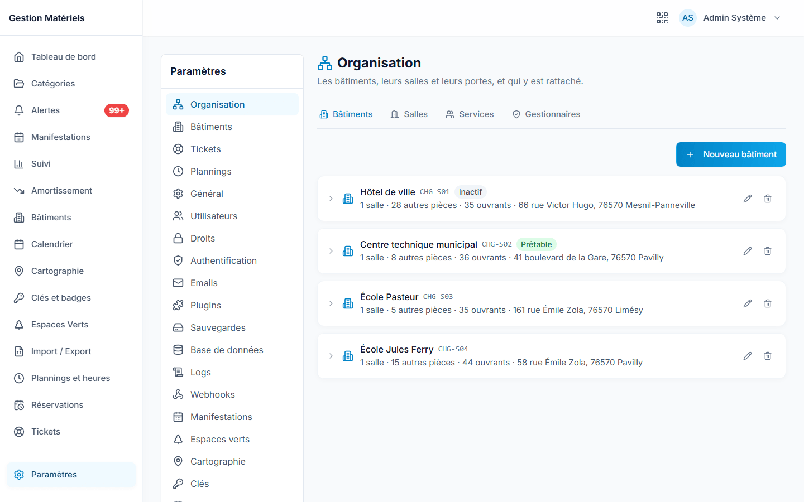

- 🏛️ **Bâtiments** : l'arbre bâtiment › pièces › portes, et les personnes rattachées avec quatre droits indépendants — *Responsable*, *Voit*, *Reçoit*, *Gère*
- 🚪 **Salles** dans un seul tableau (places, prêt, activité), et leur disponibilité publiée pour un formulaire de réservation externe
- 👥 **Services** : membres, périmètre de catégories, responsable et délégations
- 🛡️ **Gestionnaires** : la gestion se confie sans changer le rôle — un gestionnaire de bâtiment gère ce bâtiment et rien d'autre, et ne peut pas étendre lui-même son périmètre

### 🌳 Espaces verts

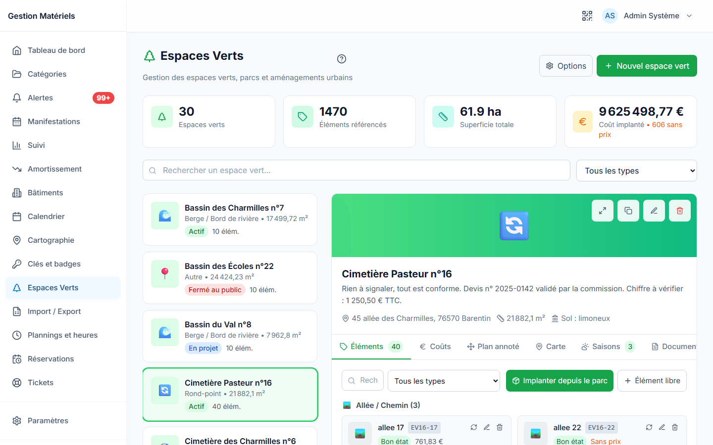

- 🛰️ **Le plan se fabrique depuis la carte** : photo aérienne IGN, plan IGN ou OpenStreetMap, déjà à l'échelle, sans clé ni compte tiers ; le contour du parc est proposé depuis OpenStreetMap
- 🗺️ **Plan annoté** qui se manipule à la main : poser, déplacer, dessiner des zones, mesurer ; surfaces calculées ; calques, légende, raccourcis clavier
- 📦 **Implantation depuis le parc** : rosiers, bulbes, gazon, mobilier se posent en quantité, dans le parc ou dans une jardinière
- 💶 **Prix figé à la pose** : ce qu'un massif a réellement coûté, des années après ; coûts par groupe, variété, type, année et nature de lieu
- 🌿 Éléments (arbre, arbuste, massif, haie, pelouse, bassin, mobilier…) avec état de santé, **groupes de composition**, **entretiens**, **documents**, **saisons**
- 📸 **Clonage**, **archives** et **comparaison** d'un état archivé avec l'état actuel ; remplacement d'éléments tracé
- 📊 **Export PDF** du plan annoté avec légende et tableaux

<table>
<tr>
<td width="50%">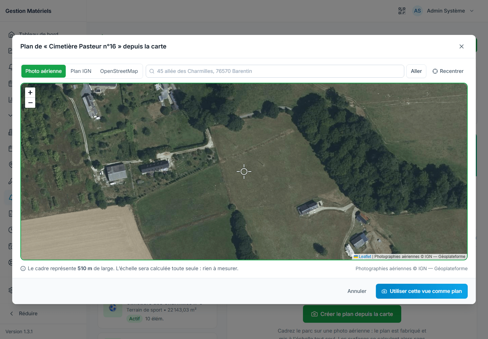</td>
<td width="50%">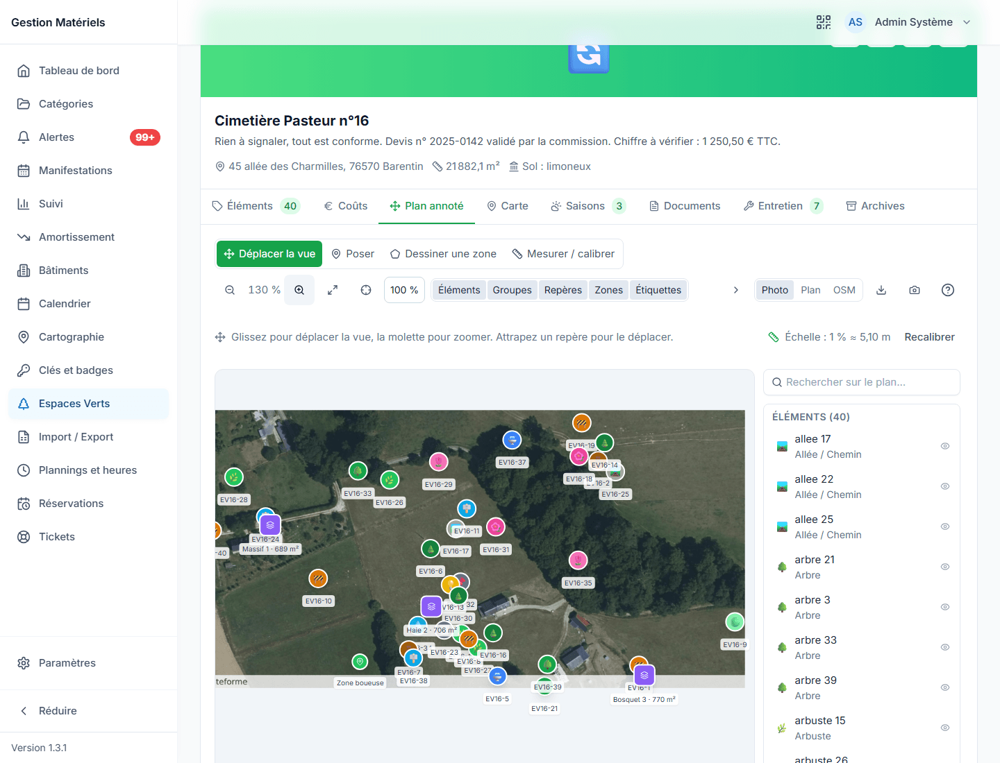</td>
</tr>
<tr>
<td align="center"><sub>Le plan se cadre sur la photo aérienne, déjà à l'échelle…</sub></td>
<td align="center"><sub>…puis s'annote : éléments, groupes, zones et surfaces</sub></td>
</tr>
</table>

### 🗺️ Cartographie

Où est implanté le matériel — voirie et espaces verts sur la même carte, exemplaire par exemplaire.

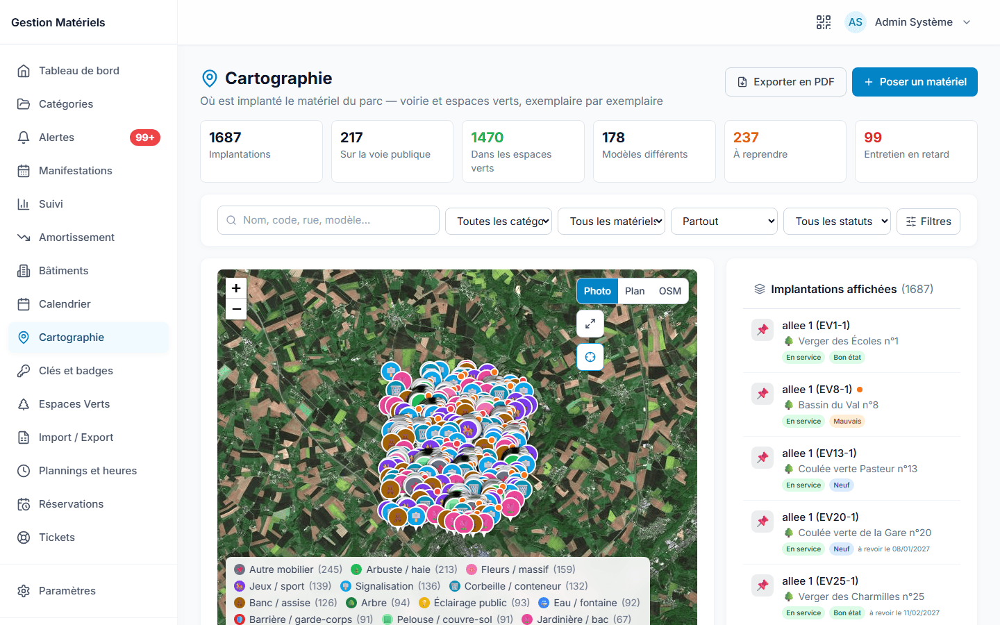

- 🪑 **Un modèle au parc, des exemplaires sur le terrain** : « Banc modèle Ville » reste une fiche, ses 23 exemplaires se posent numérotés, chacun avec sa position, sa rue, son état et son historique
- 📍 **Poser en trois questions** — quoi, où, le reste — au doigt sur la carte, avec **« Utiliser ma position »**, ou dans une jardinière déjà posée ; adresse, rue et quartier lus du point
- 🎨 **Marqueurs** colorés par famille (éclairage, banc, corbeille, arbre…), pastilles pour ce qui est hors service ou en retard d'entretien ; position approchée tracée en pointillés
- 🔧 **Un historique par exemplaire** : onze natures d'intervention, état après intervention, prochaine échéance
- 🔍 **Recherche à deux étages**, dont « autour de moi » à 100 m, 300 m ou 1 km
- 📄 **Export PDF paramétrable** : regroupement par matériel, lieu, rue, zone, catégorie, statut ou état ; seize colonnes au choix ; la carte telle qu'affichée
- 🗃️ **« Déposé » plutôt que supprimé** : un candélabre retiré garde son historique

### 📅 Calendrier et alertes

<table>
<tr>
<td width="50%">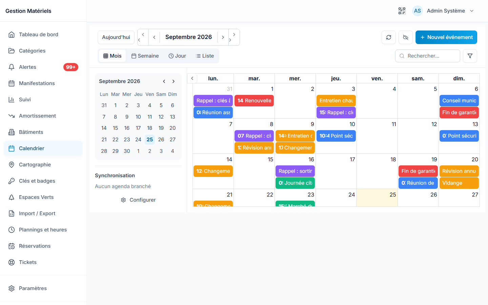</td>
<td width="50%">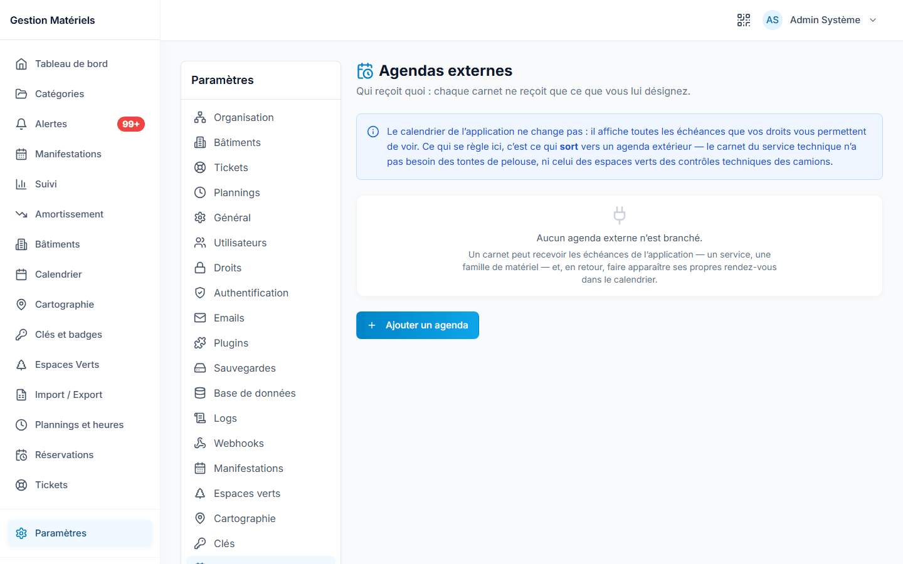</td>
</tr>
</table>

- 📆 Vues mois, semaine, jour et liste, mini-calendrier, recherche et filtres par type
- 🔗 **Autant d'agendas externes que nécessaire** — CalDAV (Nextcloud, Synology, iCloud, Google) et Outlook — chacun ne recevant que les natures d'échéance et les catégories qu'on lui désigne, avec un **aperçu avant l'envoi**
- ↔️ Envoi, réception, ou les deux
- ⚠️ **Alertes automatiques** (échéances, retards, contrôles, espaces verts), compteur en temps réel, notifications par e-mail et **rapport hebdomadaire** aux administrateurs et superviseurs

### 🔄 Réservations, amortissement, import/export

<table>
<tr>
<td width="33%">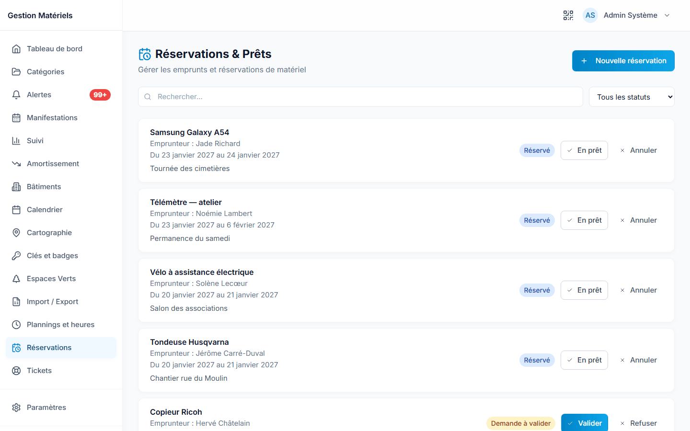</td>
<td width="33%">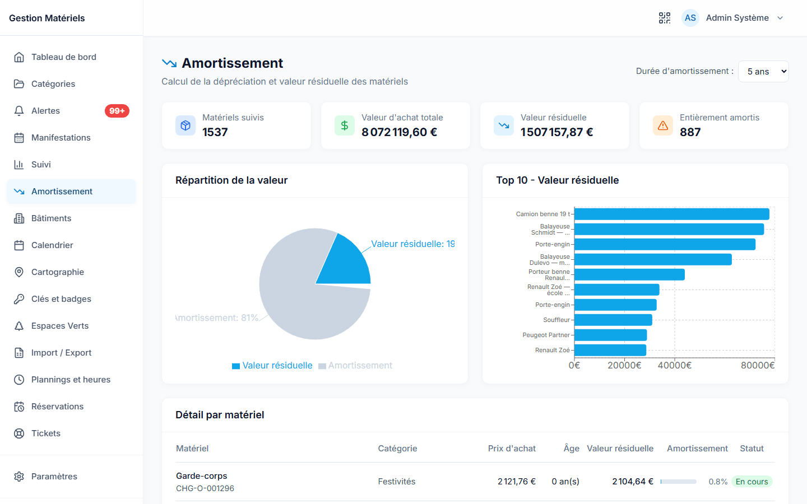</td>
<td width="33%">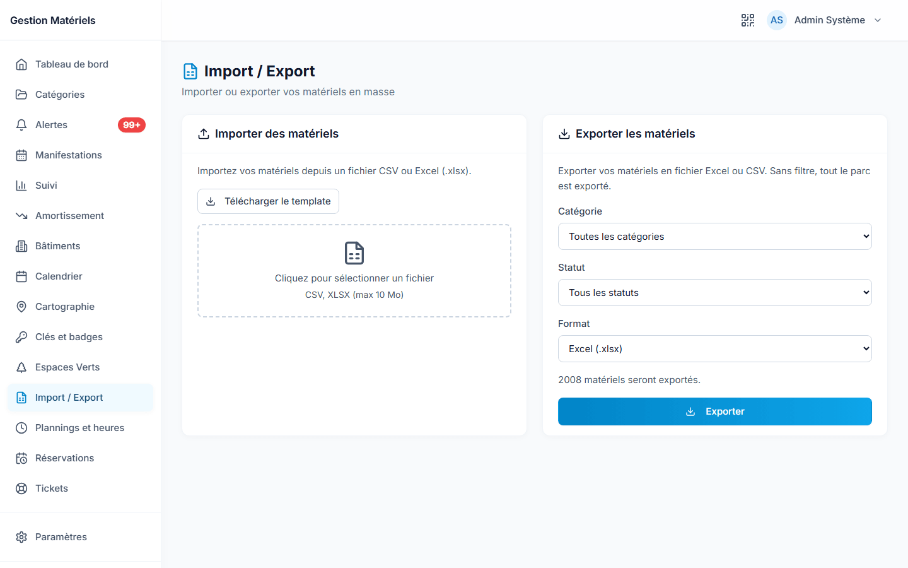</td>
</tr>
</table>

- 🔄 **Réservations et prêts** : disponibilité affichée avant l'envoi, demandes à valider, statuts réservé / en prêt / retourné / en retard, alertes de retard
- 📉 **Amortissement** linéaire, valeur résiduelle et graphiques
- 📥 **Import CSV/Excel** reconnu par intitulé de colonne, corrigeable avant l'import ; 📤 **export réimportable**, filtrable, cloisonné par catégorie

### 👥 Utilisateurs, rôles et droits

<table>
<tr>
<td width="50%">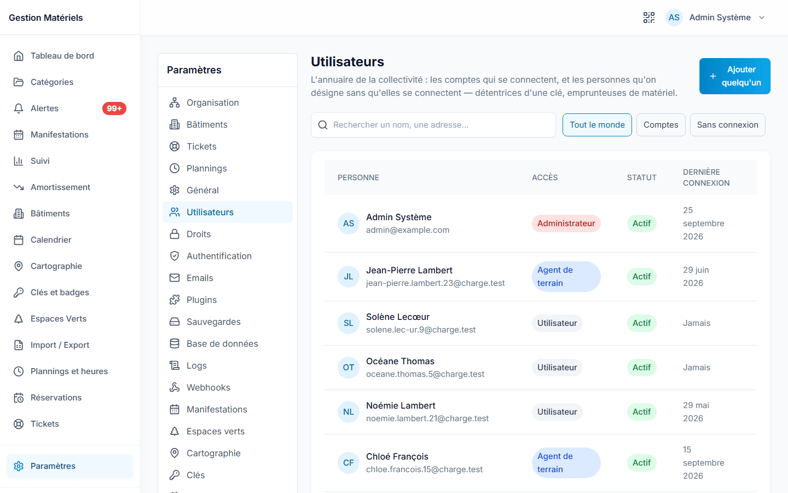</td>
<td width="50%">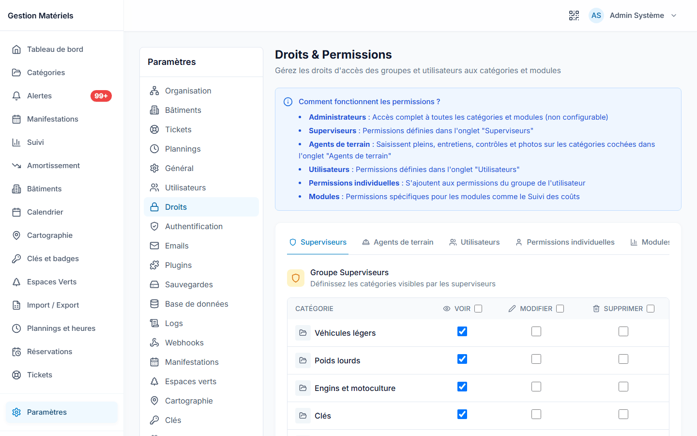</td>
</tr>
</table>

- 🧑‍🤝‍🧑 **Un seul annuaire** : les comptes qui se connectent, et les personnes qu'on désigne sans qu'elles se connectent — le gardien qui détient une clé, l'élu, l'emprunteur. Accorder un accès plus tard ne recopie personne
- 🔏 **Passkeys** (empreinte, visage, clé USB), en connexion sans mot de passe ou en second facteur ; ✅ **Rester connecté** ; 🔑 réinitialisation par e-mail
- 🔐 **Droits par catégorie** (voir, modifier, supprimer) par groupe et par personne, et droits par module

| Geste | Utilisateur | Agent de terrain | Superviseur | Admin |
|-------|:-----------:|:-----:|:-----------:|:-----:|
| Consulter | ✓ | ✓ | ✓ | ✓ |
| Relevé de plein, entretien, contrôle, photo | | ✓ | ✓ | ✓ |
| Créer / modifier un matériel | | | ✓ | ✓ |
| Gérer le référentiel et supprimer | | | ✓ | ✓ |
| Inscrire une personne sans compte | | | ✓ | ✓ |
| Comptes, accès, sauvegardes, permissions | | | | ✓ |

Un cinquième rôle, **service partenaire**, n'ouvre que les manifestations et les tickets : tout le reste de l'API lui est fermé par défaut.

### ⚙️ Administration

<table>
<tr>
<td width="50%">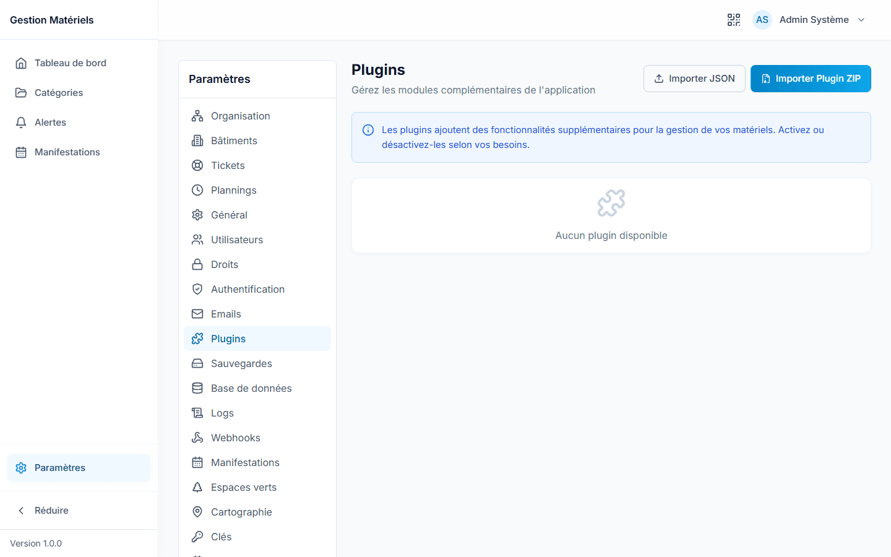</td>
<td width="50%">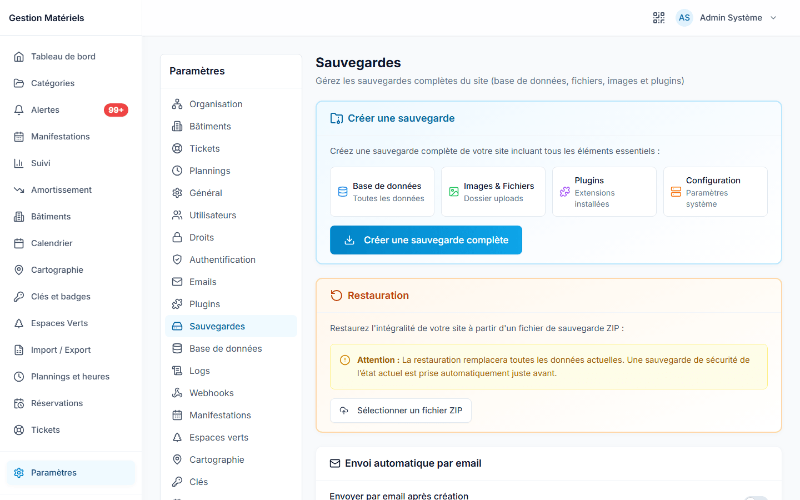</td>
</tr>
</table>

- 🔌 **Plugins** activables un à un — carburant, maintenance, contrôle technique, calendrier, réservations, amortissement, cartographie, import/export, manifestations, espaces verts, plannings, tickets, clés, bâtiments — et **plugins importés en ZIP** (tables, pages JSON, API dynamiques, composants d'interface)
- 💾 **Sauvegarde et restauration** complètes, SQLite comme MySQL (tables, fichiers, plugins), sauvegarde nocturne, sauvegarde de sécurité avant chaque restauration ; **migration** de SQLite vers MySQL/MariaDB
- 📧 **SMTP** avec test d'envoi, **modèles d'e-mails** Handlebars, **suspension des envois automatiques** d'un interrupteur
- ☁️ **Nextcloud** : connexion, explorateur de dossiers, dépôts et modèles de documents
- 🔗 **Webhooks** signés en HMAC-SHA256 sur douze événements
- 📖 **API** : Swagger UI, spécification OpenAPI, **jetons d'API** en lecture seule ou en écriture
- 📋 **Journal** filtrable et exportable ; paramètres généraux (nom du site, logo, favicon)
- 🧪 **Données de test** : un gros jeu cohérent dans tous les modules, une purge qui ne retire que lui, puis une réinitialisation vers une base vierge avant la mise en production

<details>
<summary>API et jetons</summary>

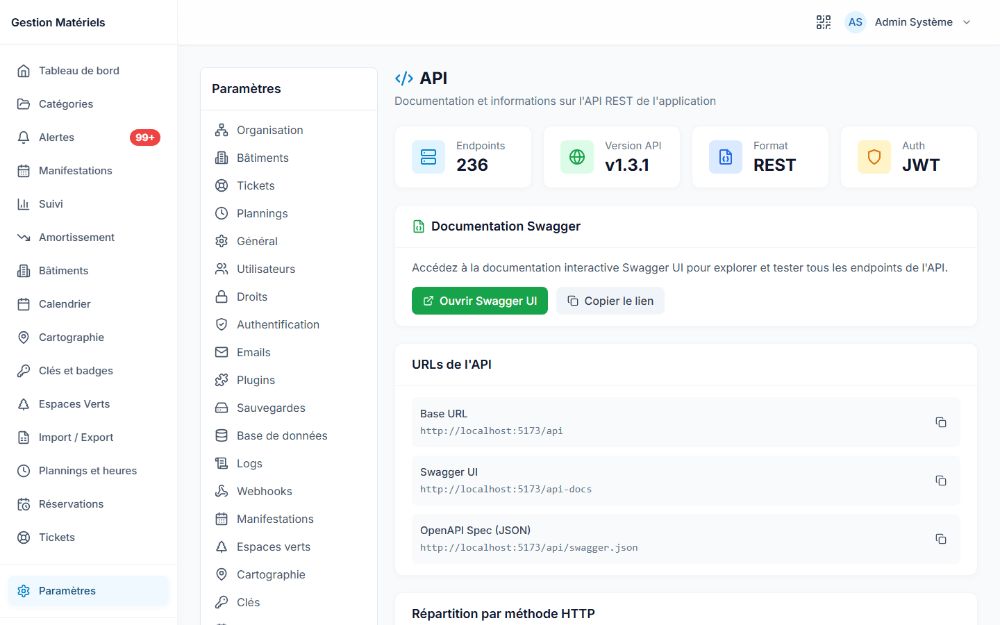
</details>

### 🎨 Interface

<table>
<tr>
<td width="50%">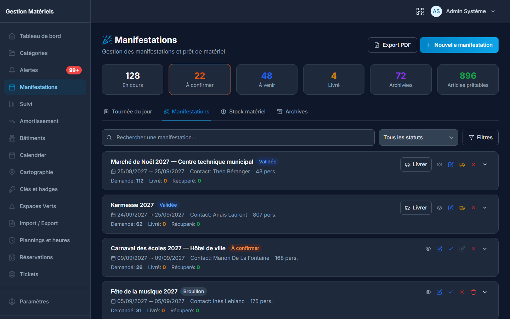</td>
<td width="50%">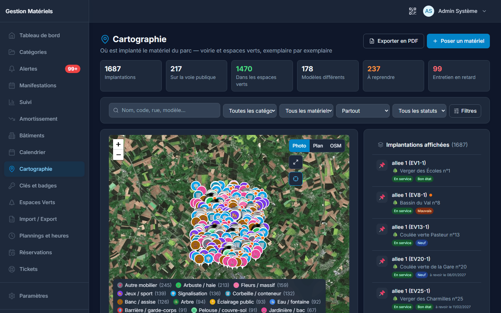</td>
</tr>
</table>

- 🌙 **Thème sombre** (clair, sombre ou système) sur toutes les pages ; un export lancé en sombre sort en clair
- 📲 **PWA** installable, cache pour la consultation hors ligne (Workbox)
- ⚡ **Temps réel** par Socket.io, avec repli sur le polling derrière un proxy
- ❓ **Aide contextuelle** par page, écran d'erreur avec bouton Réessayer
- 🇫🇷 Interface en français. Les fichiers de traduction FR/EN existent, mais la détection automatique de langue a été retirée : elle basculait toute l'interface en anglais sur une tablette configurée en anglais

## 🚀 Installation

### Prérequis

- Node.js >= 20.0.0
- npm >= 9.0.0
- (Optionnel) Docker et Docker Compose

### Installation locale

1. **Cloner le dépôt**
```bash
git clone https://github.com/wdebonne/gestion-materiels.git
cd gestion-materiels
```

2. **Configurer les variables d'environnement**
```bash
cp .env.example .env
# Éditer le fichier .env avec vos paramètres
```

3. **Installer les dépendances**
```bash
npm install
cd client && npm install && cd ..
```

4. **Lancer l'application en développement**
```bash
npm run dev   # serveur (3001) et client (5173) ensemble
```

5. **Accéder à l'application**
- Frontend : http://localhost:5173
- Backend API : http://localhost:3001

### Identifiants par défaut

| Rôle | Email | Mot de passe |
|------|-------|--------------|
| Administrateur | admin@example.com | admin123 |

⚠️ **Important** : changez ces identifiants dès la première connexion !

### Tester avec beaucoup de données

Paramètres › **Base de données** › *Données de test* charge un jeu cohérent dans tous les modules, du volume « Petit » (≈ 40 000 lignes) à « Très gros » (≈ 1,2 million). Les comptes générés sont en `prenom.nom.N@charge.test`, mot de passe `Charge2026!`.

- Le chargement **suspend les envois d'e-mails automatiques** ; la purge les rétablit.
- **Purger** ne retire que le jeu généré ; ce qui a été saisi à la main reste.
- **Réinitialiser pour la production** efface toutes les données et ne garde que la configuration et les administrateurs. Une sauvegarde de sécurité est prise avant, puis la base est verrouillée : chargement et réinitialisation sont refusés tant que le serveur n'est pas démarré avec `AUTORISER_DONNEES_TEST=true`.

En ligne de commande, sur une base dont le nom contient « test » ou « charge » :

```bash
MYSQL_DATABASE=gestion_materiels_charge DB_TYPE=mysql npm run db:charge -- --echelle=1
DB_PATH=./data/charge.sqlite npm run db:charge -- --echelle=0.1
npm run db:charge -- --purger
```

`--echelle` règle le volume (`0.1` pour un essai rapide), `--graine` rend le même jeu d'une fois sur l'autre, `--forcer` passe outre le nom de la base (jamais en `NODE_ENV=production`).

## 🐳 Déploiement avec Docker

### Configuration rapide

1. **Créer le fichier d'environnement**
```bash
cp .env.example .env
```

2. **Configurer les variables importantes**
```env
# Sécurité - OBLIGATOIRE en production, minimum 32 caractères.
# L'application refuse de démarrer si ce secret est absent, trop court,
# ou laissé à sa valeur d'exemple.
JWT_SECRET=votre_secret_jwt_tres_long_minimum_32_caracteres

# Base de données
DB_TYPE=sqlite  # ou mysql

# SMTP (optionnel mais recommandé)
SMTP_HOST=smtp.example.com
SMTP_PORT=587
SMTP_USER=user@example.com
SMTP_PASS=votre_mot_de_passe
SMTP_FROM=noreply@example.com
```

3. **Lancer avec Docker Compose**

Deux piles au choix, indépendantes l'une de l'autre.

```bash
# SQLite — un fichier, rien à administrer
docker compose up -d

# MySQL — serveur dédié dans un conteneur
docker compose -f docker-compose.mysql.yml up -d
```

La pile MySQL exige trois secrets dans `.env`. Sans eux elle refuse de démarrer avec un message explicite, plutôt que de tourner avec un mot de passe lisible dans le dépôt :

```env
JWT_SECRET=…            # node -e "console.log(require('crypto').randomBytes(48).toString('hex'))"
MYSQL_ROOT_PASSWORD=…
MYSQL_APP_PASSWORD=…
```

Le port du serveur MySQL n'est pas publié sur l'hôte : seul le conteneur applicatif y accède, par le réseau interne. Les deux piles ont leurs propres réseau, volumes et port, et peuvent donc tourner en même temps — mais elles ne partagent aucune donnée : passer de l'une à l'autre demande un export, pas un changement de fichier.

4. **Accéder à l'application**
```
http://localhost:3001   # pile SQLite
http://localhost:3002   # pile MySQL
```

> Le conteneur crée le schéma et applique les migrations au démarrage, sur les deux moteurs, avec une sauvegarde préalable de la base SQLite. Aucune commande manuelle n'est nécessaire.

Pour Portainer, voir [docs/DEPLOIEMENT_PORTAINER.md](docs/DEPLOIEMENT_PORTAINER.md).

### Derrière un reverse proxy (production)

En production, l'application redirige toute requête HTTP vers HTTPS — seuls les contrôles de santé internes en sont exemptés. Elle attend donc une terminaison TLS devant elle, qui lui transmet `X-Forwarded-Proto`.

Un exemple de configuration est fourni dans `nginx/nginx.conf`, à déposer sur le reverse proxy de la collectivité avec les certificats :

```bash
mkdir -p nginx/ssl
cp fullchain.pem nginx/ssl/
cp privkey.pem nginx/ssl/
```

> Aucun des deux fichiers `docker-compose` ne lance de service Nginx : la terminaison TLS est à monter séparément. Sans elle, un navigateur appelant `http://` reçoit une redirection 301 vers une adresse `https://` que personne n'écoute.

Derrière un autre reverse proxy que le nginx fourni, relevez la taille des envois (`client_max_body_size 30m;` ou équivalent) : par défaut, un rapport de bâtiment de plus de 1 Mo serait refusé avant d'atteindre l'application.

## 🔧 Configuration

### Variables d'environnement

| Variable | Description | Défaut |
|----------|-------------|--------|
| `PORT` | Port du serveur | 3001 |
| `NODE_ENV` | Environnement | development |
| `JWT_SECRET` | Secret JWT (**obligatoire**, ≥ 32 caractères) | - |
| `JWT_REFRESH_SECRET` | Déclaré dans `docker-compose.yml` mais **lu par personne** : le jeton de rafraîchissement est signé avec `JWT_SECRET` | - |
| `JWT_EXPIRES_IN` | Durée du jeton d'accès | 7d |
| `JWT_REFRESH_EXPIRES_IN` | Durée du jeton de rafraîchissement | 30d |
| `SITE_URL` | URL publique inscrite dans les liens des emails à la première installation, modifiable ensuite dans **Paramètres** | `http://localhost:$PORT` |
| `APP_URL` | URL encodée dans les QR codes ; à défaut, l'hôte de la requête est utilisé | - |
| `DB_TYPE` | Type de BDD (sqlite/mysql) | sqlite |
| `DB_PATH` | Chemin BDD SQLite | ./data/database.sqlite |
| `MYSQL_HOST` | Hôte MySQL | localhost |
| `MYSQL_PORT` | Port MySQL | 3306 |
| `MYSQL_USER` | Utilisateur MySQL | - |
| `MYSQL_PASSWORD` | Mot de passe MySQL | - |
| `MYSQL_DATABASE` | Nom BDD MySQL | gestion_materiels |
| `MYSQL_ROOT_PASSWORD` | Mot de passe root du conteneur MySQL (**obligatoire** pour `docker-compose.mysql.yml`) | - |
| `MYSQL_APP_USER` | Compte applicatif créé dans le conteneur MySQL (l'image refuse `root`) | gestion |
| `MYSQL_APP_PASSWORD` | Mot de passe de ce compte (**obligatoire** pour `docker-compose.mysql.yml`) | - |
| `MYSQL_APP_PORT` | Port publié sur l'hôte par la pile MySQL | 3002 |
| `SMTP_HOST` | Serveur SMTP | - |
| `SMTP_PORT` | Port SMTP | 587 |
| `SMTP_USER` | Utilisateur SMTP | - |
| `SMTP_PASS` | Mot de passe SMTP | - |
| `SMTP_FROM` | Email expéditeur | - |
| `AUTORISER_DONNEES_TEST` | Rouvre le chargement de données de test après une réinitialisation pour la production | - |
| `VITE_GOOGLE_MAPS_KEY` | Clé Google Maps côté client, optionnelle (sans elle, l'aperçu utilise OpenStreetMap) | - |

> Au démarrage en production, l'application refuse de se lancer si `JWT_SECRET` est absent, trop court, ou reste sur une valeur d'exemple. Il n'y a plus de secret de repli. `JWT_REFRESH_SECRET` n'est pas vérifié, puisque personne ne le lit.

> `MYSQL_HOST` et `MYSQL_PORT` ne concernent qu'une connexion à un serveur MySQL existant. La pile `docker-compose.mysql.yml` vise son propre service `db` et ignore ces deux variables : le `.env` de développement les met à `localhost`, ce qui ferait chercher le serveur dans le conteneur applicatif lui-même.

### Templates d'emails

Les templates d'emails utilisent la syntaxe Handlebars :

- `{{userName}}` - Nom de l'utilisateur
- `{{userEmail}}` - Email de l'utilisateur
- `{{resetLink}}` - Lien de réinitialisation
- `{{siteName}}` - Nom du site
- `{{siteUrl}}` - URL du site
- `{{alertTitle}}` - Titre de l'alerte
- `{{alertMessage}}` - Message de l'alerte

## 📖 API

| Ressource | URL | Description |
|-----------|-----|-------------|
| Swagger UI | `/api-docs` | Interface interactive pour explorer et tester les endpoints |
| OpenAPI Spec | `/api/swagger.json` | Spécification OpenAPI 3.0 (importable dans Postman, Insomnia) |
| API Info | `/api/api-info` | Métadonnées et statistiques de l'API |

La documentation est aussi accessible depuis **Paramètres › API**. La liste des routes, module par module — authentification et passkeys, parc, manifestations et réception des demandes, espaces verts, cartographie, calendrier et agendas externes, bâtiments et portail des entreprises, tickets, administration — est dans **[docs/API.md](docs/API.md)**.

## 🔒 Sécurité & Authentification

### En place

- Authentification JWT, jetons d'accès et de rafraîchissement (signés avec le même secret)
- Mots de passe hashés avec bcrypt (12 tours)
- `JWT_SECRET` obligatoire : plus de secret de repli, démarrage refusé en production s'il est absent, trop court ou laissé à sa valeur d'exemple
- Rate limiting : 10 tentatives / 15 min sur `/api/auth`, 1000 req / 15 min globalement, quotas dédiés pour les uploads et les exports
- **Portée des tokens API appliquée** : un token « lecture seule » ne peut plus écrire ni supprimer, quel que soit le rôle de son créateur
- **Portée par catégorie appliquée partout** : liste et fiche d'un matériel, recherche, réservations, événements de calendrier, export et étiquettes QR. Un compte ne voit jamais un matériel d'une catégorie qui ne lui est pas ouverte
- Un test de contrat échoue dès qu'un fichier lit la table des matériels sans appliquer cette portée
- Rôles vérifiés route par route, figés par une matrice de tests
- Fichiers du dossier `/uploads` protégés par JWT ; documents des bâtiments dans `uploads/prive/`, jamais servis en statique
- SQL des plugins verrouillé : tables système protégées, écritures interdites
- Rotation automatique des secrets JWT avec période de grâce ([docs/JWT_ROTATION.md](docs/JWT_ROTATION.md))
- Headers de sécurité HTTP (Helmet), CORS, HTTPS forcé en production
- Validation des entrées côté serveur sur les écritures de terrain
- **Politique de mot de passe appliquée** : longueur et complexité configurables, vérifiées aux six endroits où un mot de passe est défini (inscription, réinitialisation, changement, création et modification par un administrateur)
- **Blocage du compte** après N échecs pendant une durée configurable, indépendamment du rate limiting qui protège l'API dans son ensemble. Un administrateur débloque en réattribuant un mot de passe
- **Expiration du mot de passe** signalée par un bandeau, sans bloquer l'accès
- **Passkeys (WebAuthn / FIDO2) appliquées** : connexion sans mot de passe, ou passkey exigée après le mot de passe, selon les deux interrupteurs de *Paramètres › Authentification › Passkey*. La clé privée ne quitte jamais l'appareil et le serveur ne conserve que des clés publiques. Le RP ID et l'origine, laissés vides, sont déduits du domaine servi
- Le blocage après N tentatives n'est pas opposé à une passkey : il compte des mots de passe faux, et une signature ne se devine pas. Un compte désactivé, lui, reste fermé
- Journal d'audit : connexions, échecs, déconnexions, changements de configuration

Voir aussi l'[audit de sécurité de l'API](docs/AUDIT_SECURITE_API.md).

### Écrans de configuration sans effet ⚠️

Ces écrans existent dans **Paramètres › Authentification**, enregistrent leur configuration dans la table `auth_config`, et **rien ne la relit** : la connexion reste en bcrypt local seul. Ne les présentez pas comme actifs à un administrateur.

| Fonction | État réel |
|----------|-----------|
| SSO SAML 2.0 | Écran de configuration uniquement — aucun flux d'authentification |
| SSO OpenID Connect | Écran de configuration uniquement |
| LDAP / Active Directory | Écran de configuration uniquement |

Chacun de ces trois écrans affiche un bandeau qui l'indique : la configuration est conservée, mais la connexion continue de passer exclusivement par email et mot de passe. Le bouton « Tester » ne fait que vérifier la forme des valeurs saisies, pas une connexion réelle au fournisseur.

La politique de mot de passe, le blocage après N tentatives et **les passkeys**, qui étaient dans le même cas, sont désormais appliqués. Les trois réglages de l'onglet *Général* qui ne peuvent pas l'être — connexion locale, 2FA, timeout de session — ont été retirés du formulaire et remplacés par un encart qui dit pourquoi, plutôt que par des interrupteurs sans effet. Le second facteur qui, lui, existe se règle dans l'onglet *Passkey*.

## 🚧 État réel

Cette section liste ce qui est visible dans l'interface sans fonctionner, pour qu'un administrateur ne le présente pas comme acquis. Tout ce qui n'y figure pas fonctionne.

| Fonction | Ce qui existe | Ce qui manque |
|----------|---------------|---------------|
| **SSO SAML / OIDC / LDAP** | Écrans de configuration complets, table `auth_config` | Rien ne relit cette configuration : la connexion reste en bcrypt local. Les passkeys, qui étaient dans le même cas, sont désormais appliquées |
| **2FA (interrupteur « Général »), timeout de session, connexion locale** | Réglages retirés du formulaire, remplacés par un encart expliquant pourquoi | Le second facteur existant se règle dans l'onglet Passkey et ne s'applique qu'aux comptes ayant enregistré une clé ; cet interrupteur-ci n'est relu par personne. Le timeout de session demanderait un suivi d'inactivité ; désactiver la connexion locale rendrait l'application inaccessible tant qu'aucun SSO ne fonctionne |
| **Synchronisation Outlook** | Configuration enregistrable, flux OAuth réel contre Microsoft Graph | Deux manques. La requête vise `/me/calendarview` avec un jeton applicatif, que Graph refuse : il faudrait viser `/users/{identifiant}/calendarview`, donc choisir la boîte aux lettres. Et l'**envoi** n'est pas implémenté — y écrire demande le consentement délégué, que le secret d'application ne porte pas. Un carnet Outlook est donc en réception seule, et l'écran le dit. CalDAV n'a ni l'un ni l'autre problème |
| **Description des sous-catégories** | — | Ni colonne en base, ni champ de route, ni champ de formulaire. L'affichage mort a été retiré |

### Limites connues

- Les requêtes du cron encadrent leurs colonnes de dates dans `date()`, ce qui empêche les index `idx_control_expiry` et `idx_maintenance_next` de servir. Sans effet visible au volume actuel
- `JWT_REFRESH_SECRET` est déclaré dans `docker-compose.yml` mais n'est lu par personne : les deux jetons sont signés avec `JWT_SECRET`
- `PUT /api/manifestations/:id` ne lit pas le champ `status` : le statut se change uniquement via `PUT /:id/status`
- La correspondance des champs à la réception ne couvre pas encore les lignes de matériel : le chemin et les clés se règlent en base (`material_mapping`), pas dans l'écran
- Un service ne peut être mis en copie que globalement ; il n'existe pas encore de mise en copie d'une personne depuis l'écran (l'API l'accepte : `POST /:id/watchers` avec `user_id`)
- Une image déposée est systématiquement ré-encodée en JPEG par `normalizeImage()`, mais conserve son extension et son `Content-Type` d'origine : un PNG à fond transparent ressort opaque, sous un nom en `.png` dont le contenu est du JPEG. Sans effet sur un cliché de terrain, visible sur un logo ou un favicon
- **Réception d'un agenda externe : quatre réserves.** Elle ne ramène que la fenêtre **d'aujourd'hui à +90 jours** — un rendez-vous passé ou lointain ne remonte pas. Elle **remplace** à chaque passage ce qu'elle avait ramené : une modification faite dans l'application sur un événement reçu est écrasée au passage suivant, le carnet d'origine fait foi. Un événement reçu n'est **jamais réexporté** vers un autre carnet, sinon deux agendas se recopieraient indéfiniment. Enfin, un événement reçu n'est rattaché à aucun matériel, donc **aucun filtre de catégorie ne s'y applique** : il est visible par tous les comptes. Brancher un agenda personnel en réception l'expose à toute la commune — préférez un carnet de service
- L'**envoi** vers un agenda externe couvre la fenêtre **-30 jours à +365 jours** : assez pour rattraper ce qui vient d'être saisi et couvrir les échéances annuelles, sans repousser dix ans d'historique à chaque passage
- Le typage du client comporte encore des avertissements ESLint, presque tous des `any` — aucune erreur

## 🛠️ Développement

### Scripts disponibles

```bash
# Racine — lance serveur et client ensemble
npm run dev             # Développement (serveur 3001 + client 5173)
npm run build           # Build complet, types vérifiés des deux côtés
npm run build:server    # Compilation TypeScript du serveur (tsc)
npm start               # Production
npm test                # Tests backend (Jest)
npm run test:all        # Tests backend et frontend
npm run db:migrate      # Applique les migrations en attente
npm run db:migrate -- --dry-run   # Liste ce qui reste à appliquer, sans rien modifier
npm run db:charge       # Jeu de données de test (voir plus haut)

# Frontend (dans /client)
npm run dev             # Développement Vite
npm run build           # Build sans vérification de types
npm run build:check     # Build avec vérification de types (utilisé par l'image Docker)
npm run lint            # ESLint
npm run test:run        # Tests (Vitest)
```

> L'image Docker compile le serveur avec `tsc` et le client avec `build:check` : une erreur de type arrête la construction de l'image au lieu de ressortir en panne en production.

### Tests

```bash
# Backend (Jest)
npm test              # Lancer les tests backend
npx jest --coverage   # Avec couverture

# Frontend (Vitest)
cd client
npm run test          # Mode watch
npm run test:run      # Exécution unique
```

78 suites backend (Jest) et 6 suites frontend (Vitest). Les suites ci-dessous sont celles qui gardent une règle qu'on ne peut pas vérifier à l'œil — le reste couvre les routes et les écrans module par module.

| Suite | Couvre |
|-------|--------|
| `roles.test.ts` | Matrice rôle × endpoint, contrat de chaque route protégée |
| `objectScope.test.ts`, `perimetreService.test.ts`, `cloisonnementService.test.ts` | Portée par catégorie : ce qu'un compte a le droit de voir, et par quelles routes cela pourrait fuir |
| `saisie-terrain.test.ts` | Champs obligatoires des relevés, et surtout que les champs validés soient bien ceux que la route lit |
| `apiTokens.test.ts` | Portée des tokens API, méthode HTTP → permission |
| `migrations.test.ts` | Journal, ordre, non-rejeu, reprise après échec |
| `conversionPdf.test.ts` | Conversion en PDF : l'identifiant d'application du connecteur — `eurooffice` ou `onlyoffice` —, l'ordre des chemins, le refus que le connecteur rend en JSON sous un code 200, et le retrait du document témoin même après un échec |
| `materielPretable.test.ts`, `materielEspaceVert.test.ts` | Les trois états du parc — oui, non, hérite — et le fait que les deux modules ne se confondent pas |
| `coutEspaceVert.test.ts` | Prix figé à la pose, lignes sans prix comptées à part, zones écartées des coûts |
| `geometriePlan.test.ts` | Aires du plan annoté : un pourcent vertical ne mesure pas comme un pourcent horizontal, et l'oublier double la surface |
| `captureCarte.test.ts` | Échelle d'un plan capturé : elle est calculée et non relevée, donc une formule fausse passerait inaperçue jusqu'à la commande d'enrobé |
| `manifestationApprobations.test.ts` | Qui approuve quoi, dans quel ordre, et ce que change une délégation |
| `tourneeManifestation.test.ts` | Ce qu'un agent voit en arrivant le matin : quel jour un arrêt est dû, ce qu'il reste à charger ou à rentrer, ce qui est en retard |
| `saisieTerrainDroits.test.ts` | Le partage entre constater et arbitrer : l'agent pointe ce qui part et ce qui revient, le superviseur seul corrige la demande et prononce les statuts |
| `batchQuery.test.ts` | Chargement groupé : regroupement, découpage en tranches |
| `settingsColumns.test.ts` | Aucune requête n'interroge `settings` avec de mauvais noms de colonnes |
| `valeursSql.test.ts` | Le vide d'un formulaire devient `NULL`, et « ne rien dire » ne vaut pas « effacer » |
| `auth.store.test.ts` | Contrat du magasin d'authentification, « Rester connecté » |
| `offlineQueue.test.ts` | File hors ligne : ce qui est différable, sort de file, abandonné |
| `Badge`, `Button`, `Card` | Composants UI |

### Structure du projet

```
gestion-materiels/
├── client/                 # Frontend React (Vite, Tailwind, Zustand, React Query)
│   └── src/
│       ├── components/     # Composants réutilisables (ui/, plan/, settings/, lieux/…)
│       ├── pages/          # Une page par module, et settings/ pour l'administration
│       ├── stores/         # État global (Zustand)
│       ├── lib/            # API, utilitaires, file hors ligne
│       └── test/           # Tests frontend (Vitest)
├── src/                    # Backend Node.js (Express, TypeScript)
│   ├── routes/             # Routes API, une par module
│   ├── services/           # Services métier
│   ├── middleware/         # Authentification, portée par catégorie, limiteurs
│   ├── database/           # Connexion SQLite/MySQL, migrations versionnées, générateur de données de test
│   └── server.ts           # Point d'entrée
├── tests/                  # Tests backend (Jest)
├── docs/                   # Documentation (et captures/ pour ce README)
├── examples/plugins/       # Plugins d'exemple (ZIP)
├── plugins/                # Plugins installés
├── data/ · uploads/ · backups/   # Base SQLite, fichiers téléversés, sauvegardes
├── nginx/                  # Exemple de configuration du reverse proxy
├── docker-compose.yml       # Pile de production, SQLite
├── docker-compose.mysql.yml # Pile de production, MySQL
└── Dockerfile
```

Pour écrire un plugin, voir [docs/PLUGIN_STRUCTURE.md](docs/PLUGIN_STRUCTURE.md).

### 📸 Captures d'écran

Les images de `docs/captures/` ont été prises avec Playwright (Chromium, 1440 px de large, téléphone en 390 × 844), sur une base SQLite à part remplie par `npm run db:charge -- --echelle=0.1`, complétée pour le module Bâtiments (contrôles, factures d'énergie, contrats, interventions). Aucune donnée réelle n'y figure. Pour les refaire après une évolution de l'interface, repartez d'une base de ce type — jamais de la base de production.

## 📝 Licence

Licence d'utilisation personnelle © 2026 [DEBONNE Frédéric]

Ce logiciel est protégé par le droit d'auteur. L'utilisation est autorisée uniquement avec permission écrite de l'auteur. La distribution et la vente sont strictement réservées à l'auteur.

## 📞 Support

Pour toute question ou problème :
- Ouvrir une issue sur [GitHub](https://github.com/wdebonne/gestion-materiels/issues)
- Consulter la [documentation](docs/)

## 📚 Documentation

- [Fonctionnalités en détail](docs/FONCTIONNALITES.md) - Chaque module, ce qu'il fait et pourquoi
- [Référence de l'API](docs/API.md) - Toutes les routes, module par module
- [Roadmap fonctionnalités](docs/ROADMAP_FONCTIONNALITES.md) - Suivi des fonctionnalités et état réel de chacune
- [Structure des plugins](docs/PLUGIN_STRUCTURE.md) - Comment créer des plugins
- [Déploiement Portainer](docs/DEPLOIEMENT_PORTAINER.md) - Déployer avec Docker/Portainer
- [Audit sécurité API](docs/AUDIT_SECURITE_API.md) - Rapport d'audit de sécurité
- [JWT Rotation](docs/JWT_ROTATION.md) - Rotation automatique des tokens JWT
- [Exemples de plugins](examples/plugins/) - Plugins d'exemple
- [Journal des modifications](CHANGELOG.md)

---

Développé avec ❤️ pour la gestion du matériel municipal
